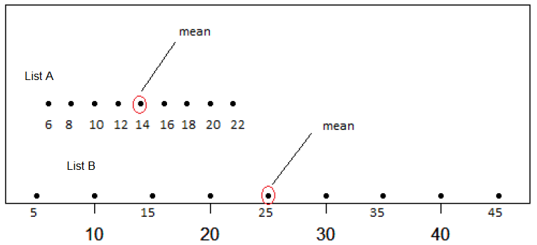
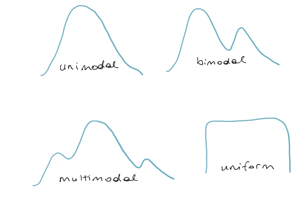
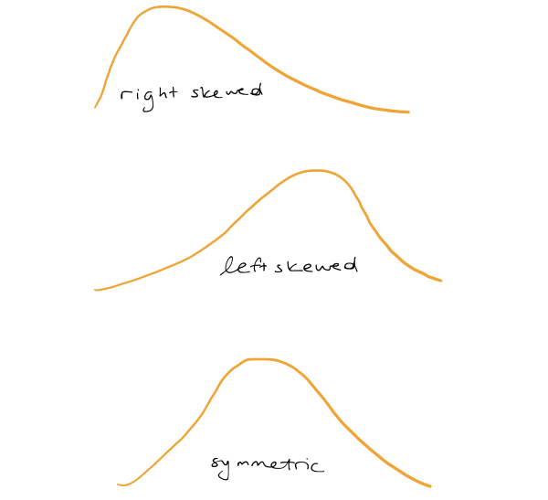

<script language="JavaScript" src="js/exercise-font-size.js"></script>

```{r setup, include = FALSE}

library(tidyverse)
library(gapminder)

library(learnr)
library(ggridges)

knitr::opts_chunk$set(warning = FALSE,
                      message = FALSE,
                      echo = FALSE, 
                      fig.height = 3,
                      fig.width = 5,
                      fig.align = "center")

western_states <- c("Montana", "Wyoming","Colorado", "New Mexico", "Idaho", "Utah", "Arizona", "Oregon", "Washington", "California", "Nevada", "Alaska", "Hawaii" )

northeast_states <- c("Massachusetts","New Hampshire", "Rhode Island", "Vermont", "Maine", "Connecticut", "New Jersey", "New York", "Pennsylvania" )

midwest_states <- c("Illinois", "Indiana", "Michigan", "Ohio", "Wisconsin","Kansas", "Missouri", "Nebraska", "North Dakota", "South Dakota", "Iowa","Minnesota")

southern_states <- c("Delaware", "Florida", "Maryland","Georgia", "North Carolina", "South Carolina", "Virginia", "District of Columbia", "West Virginia", "Alabama", "Kentucky", "Mississippi", "Tennessee", "Arkansas", "Lousiana", "Oklahama", "Texas", "Louisiana", "Oklahoma")

life <- read_csv(file="data/life_exp.csv") %>% 
  mutate(
    state = str_to_title(state),
    county = str_to_title(county),
    region = case_when( state %in% western_states ~ "West",
                        state %in% northeast_states ~  "NorthEast",
                        state %in% midwest_states ~ "MidWest",
                        state %in% southern_states ~ "South"
                        )
   ) %>% 
  filter(!is.na(region))

life_wa <- life %>%
  filter(state == "Washington") 
```

## Introduction

There are generally four characteristics of distributions that are of interest: 

  - the center, 
  
  - the spread or variability of the distribution,
  
  - the shape of the distribution, which can be described in terms of the modality and the skew.
  
  - outliers
  
We will discuss each of these in turn in this tutorial. We will be using data wrangling functions from **tidyverse**, so let's go ahead and load it. We will also use the package **ggridges** to make density ridge plots.

```{r load-packages-tidy, exercise=TRUE}

```

```{r load-packages-tidy-hint}
library(tidyverse)
library(ggridges)
```


## Data

Researchers in public health have compiled a dataset called `life` on the demographics of every county in the US. We see here that we have 4 variables: the state name, the county name, then the average life expectancy, and the median income. 

```{r life}
life
```


We are going to first focus on the life expectancy in the state of Washington which happens to have 39 counties. Filter the `life` dataset for counties from "Washington", and name the resulting data frame `life_wa`. Which county in WA state has the highest life expectancy? the lowest? 


```{r life-wa, exercise=TRUE}


```

```{r life-wa-hint}

life_wa <- life %>%
  filter(state == "Washington") 

life_wa %>% arrange(desc(expectancy)) 

```


```{r life-exp-mean}
life_wa_summary <- life_wa %>%
  summarise(
    mean = round(mean(expectancy), 2),
    med = round(median(expectancy), 2),
    var = round(var(expectancy), 2),
    sd = round(sd(expectancy), 2),
    iqr = round(IQR(expectancy), 2)
  )
```


## Measures of center

A **measure of center** refers to a **typical** observation. 
For example, you may have heard statements like the typical life expectancy in the US is 77.6 years, but where does that number come from? 

### Mean

Let's take a closer look at the life expectancies for counties in Washington. Make a histogram of the values for `expectancy` in the dataset `life_wa` you created earlier. If you had to guess a typical value for this distribution, what would you pick?


```{r life-wa-view2, exercise=TRUE}


```

```{r life-wa-view2-hint}
ggplot(data = life_wa,
       mapping = aes( x = expectancy)) +
  geom_histogram( binwidth = 0.75, alpha = 0.5)

```


One statistic we commonly use is the arithmetic mean, commonly referred to as the average. We can calculate it using the `summarise` function in the **dplyr** package. 
 
Run the following code to calculate the mean life expectancy in WA state. 
Note from the output that the `summarize` function creates a data frame containing just one variable `mean_years`. The variable name is specified by you, the user. The name is optional but helpful especially if you want to pipe the result to `arrange` to sort in order.

```{r mean, exercise = TRUE}

life_wa %>% summarise(mean_years = mean(expectancy) )

```


The average life expectancy for counties in Washington is `r life_wa_summary$mean` years.
Let's add that value as a red, dashed line to our histogram.

```{r life-wa-plot-mean}
ggplot(data = life_wa, aes(x = expectancy)) +
  geom_histogram(binwidth = 0.75, alpha = 0.5) +
  geom_vline(xintercept = life_wa_summary$mean, color = "red", linetype = "longdash", size = 1) +
  labs(title = "Life expectancy in WA state",
       subtitle = "Mean shown in red")
```

<!--- The mean can be thought of as the balance point - center of gravity - of the data. This highlights an important feature of the mean: its sensitivity to extreme values. For this reason, when working with skewed (imbalanced) distributions, the mean is not an appropriate measure of center. --->

### Median

Another measure of "typical" is the **median**. 
The median is the 50th percentile, i.e. the middle value in the sorted data. Let's take another look at the sorted life expectancies.

```{r}
life_wa %>%
  arrange(expectancy) %>% 
  pull(expectancy) 
```

The value that cuts the data in half is `r life_wa_summary$med`. We can also calculate this within  `summarise`, but this time using the `median()` function.

```{r median, echo = TRUE}
life_wa %>%
  summarise(median_years = median(expectancy))
```

Let's add that value as a blue, solid line to our histogram.

```{r life-wa-plot-mean-med}
ggplot(data = life_wa, aes(x = expectancy)) +
  geom_histogram(binwidth =0.75,alpha=0.5) +
  geom_vline(xintercept = life_wa_summary$mean, color = "red", linetype = "longdash", size = 1) +
  geom_vline(xintercept = life_wa_summary$med, color = "blue", size = 1) +
  labs(title="Life expectancy in WA state",
       subtitle = "Mean shown in red, median in blue")
```

For the life expectancies in WA state, the mean and median are practically equal since the distribution is roughly symmetric. 


<!---The **mode** is yet another measure of center. The mode is the number that occurs the most frequently in the dataset. To find the mode, we can `count()` the life expectancy values, and identify the most frequent one. Modes are most useful for describing distributions with multiple peaks and we will not consider this measure further in this tutorial.
--->


### Groupwise comparisons

Suppose we are interested in comparing life expectancy across the different U.S. states, specifically by the four regions: Northeast, West, South and Midwest. One option is to make a faceted histogram where each facet shows the life expectancies for the counties within a region. 

Go ahead and make a faceted histogram of expectancy by region.

```{r facet-histogram, exercise = TRUE}


```

```{r facet-histogram-hint-1}

ggplot(data = life, 
       mapping = aes(x = ___) ) +
  geom____()
```

```{r facet-histogram-hint-2}
ggplot(data = life, 
       mapping = aes(x = expectancy) ) +
  geom_histogram() +
  facet_wrap( facets = ___)

```

```{r facet-histogram-hint-3}
ggplot(data = life, 
       mapping = aes(x = expectancy) ) +
  geom_histogram() +
  facet_wrap( facets = vars(region))

```

Another alternative is to make side by side box plots.   
To create side by side box plots, we need to specify the following aesthetics:

 - $x$: 

 - $y$
 
where $x$ is either the numerical or categorical variable and $y$ is the other. In addition, we also need to specify that the geom will be a boxplot by adding the layer `geom_boxplot()`. 

Make a boxplot comparing the life expectancies across states by filling in the blanks in the code chunk below.

```{r life-boxplot, exercise=TRUE}
ggplot(data = ___, 
       mapping = aes(x = ___, 
                     y = ___) ) +
  geom____()
```

```{r life-boxplot-hint-1}
ggplot(data = life, 
       mapping = aes(x = expectancy, 
                     y = region) ) +
  geom____()
```


```{r life-boxplot-hint-2}
ggplot(data = life, 
       mapping = aes(x = expectancy, 
                     y = region) ) +
  geom_boxplot()
```


In addition to visualizing the differences across regions, we can also use the `group_by` and `summarize` functions to calculate the mean and median expectancies by state. 

Fill in the blanks in the code chunk below to print the mean and median life expectancy by state. 


```{r life-by-state, exercise = TRUE}
life %>% 
  group_by(___) %>%
  summarize( mean_years = mean(___), median_years = median(___) )
```

```{r life-by-state-hint-1}

life %>%
  group_by(region) %>%
  summarize( mean_years = mean(expectancy), 
             median_years = median(expectancy) )
```


Next we move on to discuss ways to measure the variability in a set of numbers.

## Measures of variability

How do you summarize the typical variability that you see in a set of numbers?


### Variance and standard deviation

Let's consider the life expectancies in Washington again. One way to think about the variability in a set of numbers is as the spread of the data around the mean. 
We'll first quantify the distance from the mean by taking the difference between each observation and that mean. 

```{r ref.label = "life-wa-plot-mean"}
```

That results in `r nrow(life_wa)` differences, some positive, some negative. 

```{r wa-deviation}
life_wa %>%
  mutate(deviation = expectancy - life_wa_summary$mean) %>% 
  select(-state, -income)
```

We'd like to reduce all of these differences to a single measure of variability, and one option is to add them up. But if we do that, the positives and negatives will cancel each other. To avoid this (and also to give higher weight to deviations from the mean that are larger), we square each difference:

```{r ma-deviation-sq}
life_wa %>%
  mutate(
    deviation = expectancy - life_wa_summary$mean,
    deviation_sq = deviation^2
    ) %>% 
  select(-state, -income)
```

and then we sum them up.

```{r wa-deviation-sq-sum}
life_wa %>%
  mutate(
    deviation = expectancy - life_wa_summary$mean,
    deviation_sq = deviation^2
    ) %>%
  summarise(sum_sq_deviation = sum(deviation_sq))
```


This new measure is better, but it has an undesirable property: it will just keep getting bigger the more data that you add. You can fix this unconstrained growth by dividing this measure by the number of observations, `r nrow(life_wa)`. Now, the quantity is a useful measure found by the following steps: 

1. Find the center (mean) of the data
2. Then find the squared distance between each observation and the mean
3. Divide the total squared distance by the number of observations ($n$) in the dataset

```{r wa-deviation-sq-mean-pop}
life_wa %>%
  mutate(
    deviation = expectancy - life_wa_summary$mean,
    deviation_sq = deviation^2
    ) %>%
  summarise(mean_sq_deviation = sum(deviation_sq) / nrow(life_wa))
```

If you change the $n$ to an $n - 1$, you get what's called the *sample variance*, one of the most useful measures of the spread of a distribution. 

```{r wa-deviation-sq-mean-samp, eval=F}
life_wa %>%
  mutate(
    deviation = expectancy - life_wa_summary$mean,
    deviation_sq = deviation^2
    ) %>%
  summarise(mean_sq_deviation = sum(deviation_sq) / (nrow(life_wa) - 1))
```

 

In R, you can use the built-in `var()` function to calculate the sample variance.

```{r var, echo=TRUE}
life_wa %>%
  summarise(var = var(expectancy))
```

Another useful measure is the square root of the *sample variance*, which is called the *sample standard deviation* or just `sd()` in R. The convenient thing about the sample standard deviation is that, once computed, it is in the same units as the original data. 

```{r sd, echo = TRUE}
life_wa %>%
  summarise(sd = sd(expectancy))
```

Since the standard deviation is a measure of spread of about the mean, it is the natural measure to use when using the mean as a typical value. 
For example, we might say that life expectancies in WA state are typically `r life_wa_summary$mean` years give or take `r life_wa_summary$sd` years. 

<!---
How many values lie within 1 standard deviation of the mean life expectancy? Ideally, we would like to see at least 50% of data points captured within this range in order to accurately describe the spread.

```{r }
ggplot(data = life_wa, aes(x = expectancy)) +
  geom_histogram(binwidth = 0.75, alpha = 0.5) +
  geom_vline(xintercept = life_wa_summary$mean, color = "red", linetype = "longdash", size = 1) +
  geom_vline(xintercept = life_wa_summary$mean-life_wa_summary$sd, linetype = "longdash", size = 1) +
  geom_vline(xintercept = life_wa_summary$mean+life_wa_summary$sd, linetype = "longdash", size = 1) +
  geom_segment(mapping=aes(x=life_wa_summary$mean-life_wa_summary$sd, y = 5, xend=life_wa_summary$mean+life_wa_summary$sd, yend=5))+
  annotate(geom="text",x=78.5, y=5.5,label="1 SD")+
  annotate(geom="text",x=79.5, y=5.5,label="1 SD")+
  labs(title = "Life expectancy in WA state",
       subtitle = "Mean shown in red, one standard deviation from the mean in black   ")
```

Use `filter` to isolate counties in WA state with life expectancy in the range 78.96 $\pm$ 1.17 years. How many such counties are there?

```{r one-sd-mean, exercise=TRUE}


```

```{r one-sd-mean-hint}

life_wa %>% 
  filter(expectancy >= 78.96 - 1.17, 
         expectancy <= 78.96 + 1.17) %>% nrow()
  

```

--->

Now that you know how to calculate the standard deviation, let's see how good you are at eyeballing it. One of the lists below has a standard deviation of about 5. Which one?





```{r mc5}
question("Which list of numbers, A or B, has a standard deviation of about 5?",
  answer("A", correct=TRUE, message = "Great! Some deviations are less than 5 and some larger than 5, which makes this a good guess"),
  answer("B", message = "Not quite, the deviations are typically much larger than 5"),
  allow_retry = TRUE
)
```


### Interquartile range

Another measure of spread that is good to know about is the **interquartile range**, or **IQR**. The IQR is the distance between the two numbers that cut-off the middle 50% of your data. This should sound familiar from the discussion of boxplots: the height of the box is exactly the IQR. 

In order to calculate the IQR, we need to find the 25th and 75th, percentiles of our data. We will let R do the calculation for us.

We can calculate these numbers using the built-in `IQR()` function.

```{r iqr, echo = TRUE}
life_wa %>%
  summarise(iqr = IQR(expectancy))
```

Just as the standard deviation and mean go hand in hand, the IQR and median are often reported together. More specifically, we might say something along the lines of the median life expectancy is `r life_wa_summary$median` years, and the range of the middle 50% of the values is 1.65 years.

### Range 

The final measure is simply the **range** of the data: the distance between the maximum and the minimum.

```{r range, echo = TRUE}
life_wa %>%
  summarise(
    min = min(expectancy),
    max = max(expectancy),
    range = max - min
  )
```

### Choosing a measure of center and spread 

For any dataset, you can compute all of these statistics, but which ones are the most meaningful? The most commonly used in practice are the mean and standard deviation, so that's often a good place to start. But what happens if the dataset has some extreme observations?

Let's say that Gray's Harbor, the county with a life expectancy around 76, instead had a life expectancy of 25. We'll create a new dataset with that value and call it `life_wa_extreme`.

```{r life-ma-extreme, echo = TRUE}
life_wa_extreme <- life_wa %>%
  mutate(expectancy = if_else(county == "Grays Harbor County", 25, expectancy))
```

Below is a look at the histogram of the data with the made up extreme value.

```{r life-ma-extreme-plot}
ggplot(data = life_wa_extreme, aes(x = expectancy)) +
  geom_histogram(binwidth=5) 
```

If you recompute the mean and the standard deviation, you see that they have both changed quite a bit, especially the standard deviation which has gone through the roof! These measures are sensitive to extreme values.

```{r sd-var-extreme, echo = TRUE}
life_wa_extreme %>%
  summarise(
    mean = mean(expectancy),
    sd  = sd(expectancy)
  )
```

If you recompute the range, it will certainly increase because it is completely determined by the extreme values. For this reason, the range is not often used.

```{r range-extreme, echo = TRUE}
life_wa_extreme %>%
  summarise(
    min = min(expectancy),
    max = max(expectancy),
    range = max - min
  )
```


However, if you recompute the median and IQR, you would see that they haven't budged. Because the rank of observations is all that matters when computing the percentiles, the median and IQR are quite unaffected by extreme values. This reveals a good situation for using the median and IQR: when your dataset is heavily skewed or has extreme observations.

```{r iqr-extreme, echo = TRUE}
life_wa_extreme %>%
  summarise(median=median(expectancy), 
            iqr = IQR(expectancy))
```


## Shape and transformations

The shape of the distribution can be described in terms of the modality and the skew.

### Modality

The modality of a distribution is the number of prominent humps that show up in the distribution. If there is a single mode, as in a bell-curve, it's called "unimodal." If there are two prominent modes, it's called "bimodal." If it has three modes or more, the convention is to refer to it as "multimodal." There is one last case: when there is no distinct mode. Because the distribution is flat across all values, it is referred to as "uniform."

The other aspect to the shape of the distribution concerns its skew.



### Skew

If a distribution has a long tail that stretches out to the right, it's referred to as "right-skewed."

If that long tail stretches out to the left, its referred to as "left-skewed." If you have trouble remembering which is which, just remember that the name of the skew is in the direction the long tail is.

If neither tail is longer than the other, the distribution is called "symmetric."



To build some familiarity with distributions of different shapes, consider the four that are plotted here. 

```{r mr3-pre}
set.seed(12)
x1 <- density(rnorm(30, 0.6, 0.2))
x2 <- density(rnorm(30, 0.6, 0.2))
x3 <- density(rexp(30, 1))
x4 <- density(c(rnorm(15, 1, 0.1), rnorm(15, 1.7, 0.1)))
y <- c(x1$y, x2$y, x3$y, x4$y)
x <- c(x1$x, x2$x, x3$x, x4$x)
d <- data.frame(x = x,
                y = y,
                group = rep(LETTERS[1:4], each = 512))
ggplot(d, aes(x = x, y = y)) +
  geom_line() +
  facet_wrap(~group, scales = "free") +
  theme(axis.title.x = element_blank(),
        axis.text.x = element_blank(),
        axis.ticks.x = element_blank(),
        axis.title.y = element_blank(),
        axis.text.y = element_blank(),
        axis.ticks.y = element_blank())
```


```{r mc3}
question("Which of the following options does the best job of describing their shape in terms of modality and skew/symmetry?",
  answer("A: bimodal symmetric; B: unimodal symmetric; C: unimodal left-skewed, D: bimodal right-skewed."),
  answer("A: unimodal symmetric; B: unimodal right-skewed; C: unimodal right-skewed, D: bimodal symmetric.", correct = TRUE),
  answer("A: unimodal right-skewed; B: unimodal left-skewed; C: unimodal left-skewed; D: bimodal symmetric."),
  answer("A: unimodal left-skewed; B: bimodal symmetric; C: unimodal right-skewed, D: unimodal symmetric."),
  allow_retry = TRUE,
  incorrect = "A useful mnemonic is the ' skew is where there is few'. That is, a left-skewed distribution has fewer values in its left tail."
)
```


### Shape of income

Let's compare the distributions of  `income` across the four regions to see what shape these distributions take. When the focus is on comparing shapes, my opinion is that a **density ridge** plot is a wonderful option. A density plot is nothing more than a smoothed out histogram. Think of it as draping a cooked spaghetti noodle on the histogram and tracing the outline.

To make density ridge plots, use `geom_density_ridges` and map the `y` aesthetic to the categorical variable. You can, in addition map `fill` to the same categorical variable in order to vary the color of each ridge plot. 


```{r income, exercise = TRUE}

ggplot(data = life,
       mapping = aes( x = ___, y= ___, fill = ___ ))+
  geom___() 

```

```{r income-hint-1}
ggplot(data = life,
       mapping = aes( x = income, y= region, fill = region))+
  geom___() 

```

```{r income-hint-2}
ggplot(data = life,
       mapping = aes( x = income, y = region, fill = region ))+
  geom_density_ridges() 

```


The choice of measure for center and spread can dramatically impact our understanding of the data, so it is important that you consider the shape of the distribution before deciding on the measure.

<!---
```{r mc2-pre}
rskew <- rexp(1000, 1)
symm <- rnorm(1000)
d <- data.frame(x = c(rskew, symm),
                distribution = rep(c("A", "B"), c(1000, 1000)))
ggplot(d, aes(x = x, fill = distribution)) +
  geom_density(alpha = 0.3)
```


```{r mc2}
question("Which measure of center and spread would be *worst* for describing the two distributions shown here?",
  answer("A: median + IQR, B: median + IQR", message = "Given the two distributions, this seems like it'd be okay."),
  answer("A: mean + SD, B: median + IQR", message = "Given the two distributions, this seems like it would be best"),
  answer("A: median + IQR, B: mean + SD", correct = TRUE, message = "Good job!" ), 
  incorrect = "A has a high peak and its width is large. What does that tell you about its standard deviation?",
  allow_retry = TRUE
)
```

--->

Based on the shape of the income distributions, what should we calculate as measures of center and spread? 

## Outliers

We've discussed three different aspects of a distribution - center, spread and shape -  that are important to note
when conducting an exploratory data analysis. A fourth and final thing to look for are outliers. These are observations that have extreme values far from the bulk of the distribution. 


We saw some extreme values when we created the density ridge plot of income. What are we to make of the loooooong tails to the right? One thing we can do is also display the data using a boxplot. 

```{r box-income, exercise=TRUE}


```


```{r box-income-hint}

ggplot(life, aes(x = income, y = region)) +
  geom_boxplot() 
```


What we see is interesting: the boxplot flags many counties within a region as outliers. <!---So why was the blip more apparent on the West Coast? It has to do with sample size. There are far fewer counties in the West Coast group, so these few outliers have an over-sized effect on its density plot. In the case of the non-West Coast group, there are many more counties that ended up washing out the effect of the outliers in the density plot.--->

A useful tool when inspecting outliers is to filter the dataset to only include outliers, and then arrange them in decreasing order. Let's do that next. In this case, we've picked a threshold for outliers as counties with incomes greater than $100,000.

```{r, echo = TRUE}
life %>%
  filter(income > 100000) %>%
  arrange(desc(income))
```

Based on the output, we learn that the top income county is actually Teton County, in the Grand Tetons of Wyoming, and that three of the other top ten counties are in Texas and two are in Nebraska. 

If we decide that the outliers are unusual, either because they are errors in data entry or because they represent anomolous cases, we can exclude them from further analysis. If not, we must leave them in the dataset.

<!---
An alternate strategy for "bringing in" the outliers is to consider a transformation. Since income has a heavy right skew, either the square-root or log-transform will do a good job of drawing in the right tail and spreading out the lower values so that we can see what's going on. We can perform the transformation by wrapping income in the `log()` function, which will take the natural log ($ln$). 

Create the overlaid density plots your created earlier, but for the natural logarithm of income. The result is a plot that looks more symmetric and with fewer outliers indicated.

```{r inc2, exercise=TRUE}

```

```{r inc2-hint}

ggplot(data = life,
       mapping = aes(x = log(income), fill = coast))+
  geom_density(alpha = 0.3)
```


## Your Turn

Please read my expectations for group work.

**Please read my expectations for breakout rooms. Introduce yourselves to each other, preferably enabling your camera. Assign a facilitator role to one person who will lead the discussion. This person must encourage coding out loud, and not just tell everyone what to do. If no one is willing, take turns for each question. ** 


Let's return to the `gapminder` data from the package of the same name.  Go ahead and load the package.

```{r load-packages, exercise=TRUE}

```

```{r load-packages-hint}
library(gapminder)
```


Take a peek at the dataframe in the code chunk below.

```{r peek-gap, exercise=TRUE}


```

In this section, we will focus on how the life expectancy in 2007 differs from continent to continent. 

- Create a dataset called `gap2007` that contains only data from the year 2007. Graphically compare the distributions of life expectancy by constructing density ridge plots and box plots for each continent. 

 - What features of the data are revealed in the density plot but masked in the box plot? How about vice versa? 
 
 - Can you identify the name of the outlying country in Asia? 

 
```{r gap-2007, exercise=TRUE}

   
```


```{r gap-2007-hint-1}
gap2007 <- gapminder %>% filter(year == 2007)

# density ridges
ggplot(data = ___,
       mapping = aes( x = ___, 
                      y = ___, 
                      fill = ___) )+
  geom___()

#boxplot
ggplot(data = ___,
       mapping = aes( x = ___, 
                      y = ___) )+
  geom___()
   
```


```{r gap-2007-hint-2}
gap2007 <- gapminder %>% 
  filter(year == 2007)

ggplot(data = gap2007,
       mapping = aes( x = lifeExp, 
                      y = continent, 
                      fill = continent) )+
  geom_density_ridges(alpha=0.3)

#boxplot
ggplot(data = ___,
       mapping = aes( x = ___, 
                      y = ___) )+
  geom___()
   
```


```{r gap-2007-hint}

gap2007 <- gapminder %>% filter(year == 2007)

ggplot(data = gapminder,
       mapping = aes( x = lifeExp, 
                      y = continent, 
                      fill = continent) )+
  geom_density_ridges(alpha=0.3)

#boxplot
ggplot(data = gapminder,
       mapping = aes( x = lifeExp, 
                      y = continent) )+
  geom_boxplot()

#name of outlier in Asia

gap2007 %>% 
  filter(continent == "Asia", lifeExp < 50) %>%  
  select(country)
   
```

```{r ex2-setup}
gap2007 <- filter(gapminder, year == 2007)
```


 - Using the shape of the density plot you created above for Asia,  calculate the most appropriate measures of center and spread for the distribution of life expectancy. 

```{r ex3, exercise = TRUE, exercise.setup="ex2-setup"}

```

```{r ex3-hint-1}
gap2007 %>% filter(continent == ___) 

```

```{r ex3-hint-2}
gap2007 %>% filter(continent == "Asia") %>% 
       summarise( ___)

```

```{r ex3-hint}
gap2007 %>% filter(continent == "Asia") %>% 
       summarise(median_exp = median(lifeExp), 
                 iqr = IQR(lifeExp) )

```

--->

## Wrap up

Congratulations!! You have successfully completed the lesson on summarizing and visualizing numerical data.


## Acknowledgment

This tutorial is excerpted from Introduction to Modern Statistics.


